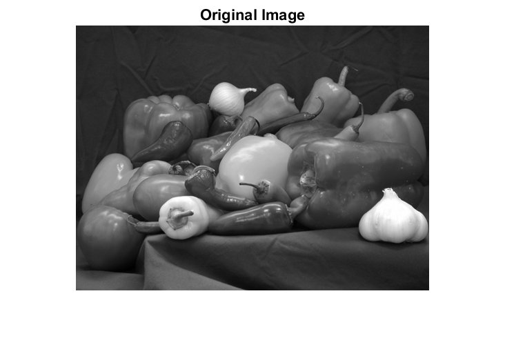
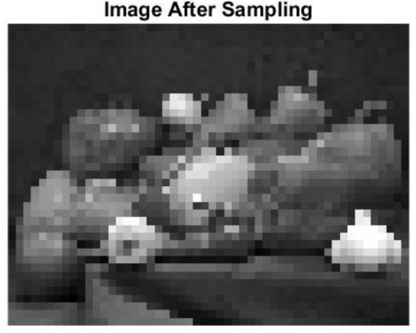
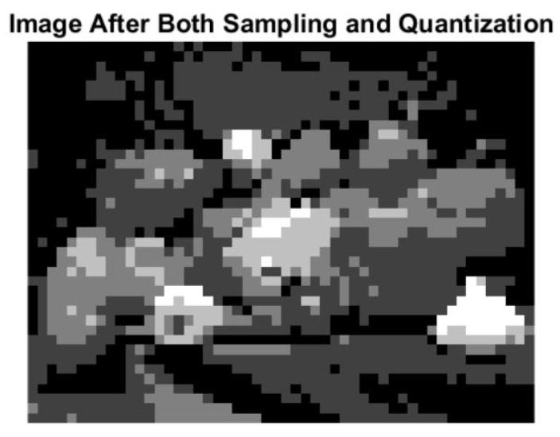

# Image-Sampling-and-Quantization

### Image Compression
- #### Downsampling
- #### Quantization

In image compression, we want to reduce the required data to store and represent the image. Downsampling reduces the number of samples. This reduces the data stored or transmitted. Qunatization reduces the representation of the image using discrete values. This reduces the bit representation per pixel intensity.

